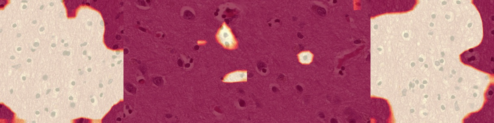
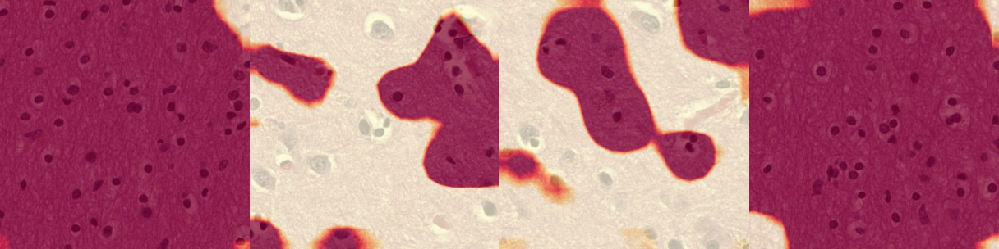
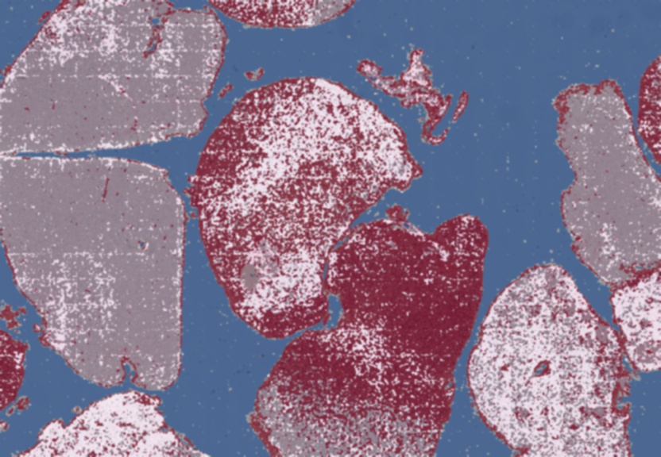

# Keras heatmap generator on large images (single & multi layer options)

Given an image of any size, generates a single or multi-layered heatmap over the entire image. You can choose to see which parts of the image represent a certain class or see which parts of the image represent different classes. Alongside the generated heatmap, returns a predicted percent breakdown of each class within the image

Works well with medical imaging or other images where spacial structure is not-important. Concretely, images that are comprised of repeated smaller images which are identifiable even if the entire image is not present are required.

Notes
1. Although an image of any size is usable, it cannot be smaller than the image dimensions your CNN was trained on
2. If image dimensions are not multiples of the CNN's trained image size, rightmost and/or bottommost parts of the image are ignored
3. multi-layered CAM currently works with **up to 6 classes**

## Demo

https://github.com/kevinfaust0308/ImageHeatmapGeneratorDemo

## Getting Started

1. overlay_single_layered_cam_large_image
Given a large image, generates heatmap on a specific class of interest 

2. overlay_multi_layered_cam_large_image
Given a large image, generates heatmap using the top-x predicted classes

Built for the VGG models (or any sequential model) with a global average pooling layer followed by a single input -> output layer

Included jupyer notebook contains examples 

### Prerequisites

```
keras
matplotlib
numpy
opencv
```

## Results

#### Single Layer (red = strong prediction)

##### 1. Areas that contain gray matter brain tissue



##### 2. Areas that contain white matter brain tissue



#### Multi Layer 

##### Areas of multiple classes

###### | Blank --> Blue | Gray Mat. --> Gray | Lesion --> Red | White Mat. --> White |



## License

This project is licensed under the MIT License - see the [LICENSE.md](LICENSE.md) file for details

## Acknowledgments

Original paper: https://arxiv.org/pdf/1512.04150.pdf
